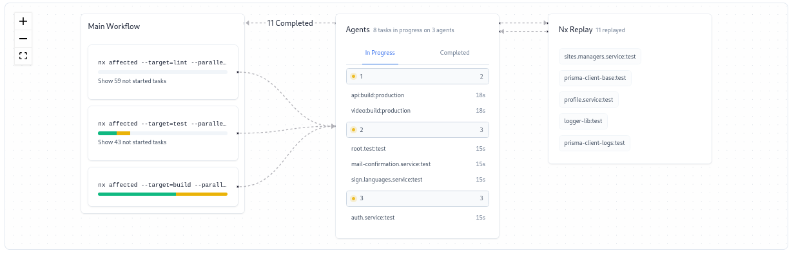

>Git repository: https://github.com/NoLoSay/MonoloBack

>[NX Modules graph](nx-graph.html#/projects/all?groupByFolder=true)

# MonoloBack Documentation 

1. [Introduction](#introduction)
	1. [Context](#context)
	2. [Versioning](#versioning)
	3. [Good practices](#good-practices)
2. [Setting-up your environment](#setting-up-your-environment)
3. [Getting started with NX](#getting-started-with-nx)
4. [Developing on Monoloback](pages/developing-on-monoloback.md)

# Introduction

### Context

See [Nx Monorepo](pages/etude-monorepo-nx.md)

### Versioning

We will be using semantic versioning (MAJOR.MINOR.PATCH)

### Good practices

See [monoloback-contributing](pages/monoloback-contributing.md)

# Setting-up your environment

### Tools and programs used

- [Docker](https://docs.docker.com/get-started/get-docker/) & [Docker Compose](https://docs.docker.com/compose/install/)
- [VSCode](https://code.visualstudio.com/docs/setup/setup-overview) (you can use any IDE you want but these ones have integrated support from NX)
- [NodeJS](https://nodejs.org/en/download/) 18 or above with [Yarn](https://classic.yarnpkg.com/lang/en/docs/install)
- [Prisma](https://www.prisma.io) with [Prisma Studio](https://www.prisma.io/studio)
- [NX](https://nx.dev/getting-started/intro) with its [IDE extensions](https://nx.dev/core-features/integrate-with-editors)

### Creating an environment file and the secrets folder

Paste this [Template Environment](https://raw.githubusercontent.com/NoLoSay/MonoloDoc/main/monoloback/pages/template-environment.md) into a `.env` file at the root of the repository and fill the missing data. Most of the data has been removed for security purposes. Do not hesitate to ask the team for help if needed. 

Create a folder named `secrets` at the root of the repository and ask one of your coworkers to give you the files that goes inside

# Getting started with NX

See: https://nx.dev/getting-started/intro

[NX Cloud workspace](https://cloud.nx.app/orgs/652159fe39cec102ad48ba93/workspaces/6521644d142961716fffcefb/overview)

### NX Cloud example PR

