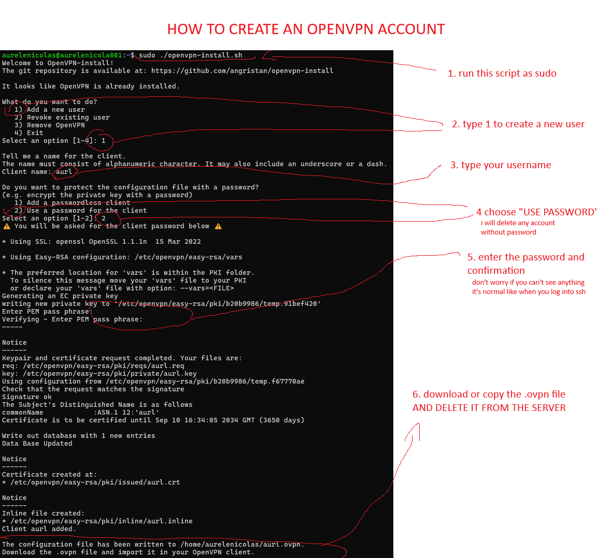

>Git repository: https://github.com/NoLoSay/NoLoAdmin

# NoLoAdmin Documentation 

### [Contributing](pages/noloadmin-contributing.md)

### [Refine.dev](https://refine.dev/)

We are running **REFINE.DEV** powered by **Vite** with the **Ant Design** UI framework

**REFINE.DEV** is a **React** framework, you must familiarize yourself with **TSX** files before starting

[See documentation](https://refine.dev/docs/)

### Components

We use standard **TSX** components with a few custom ones from our framework (`"@refinedev/antd"`)

### [Create a page](pages/create-page.md)

### Create VPN account

